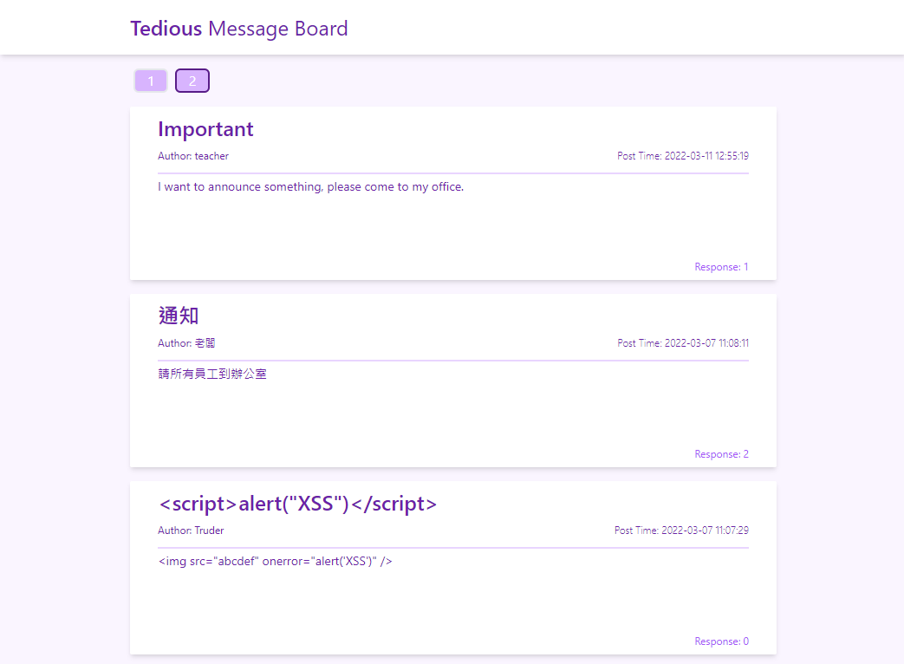
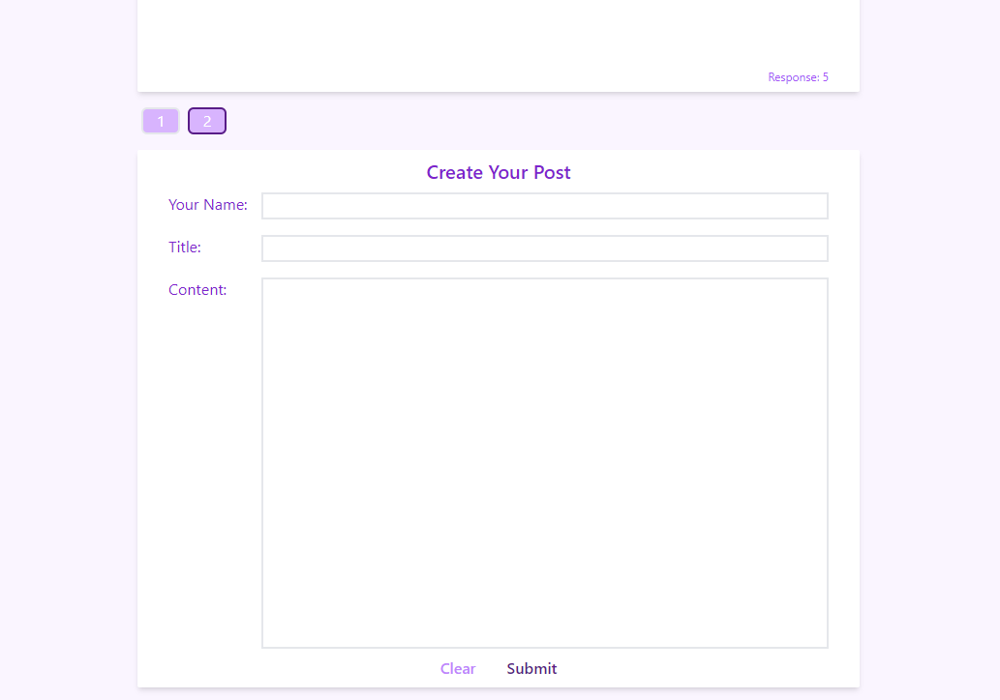
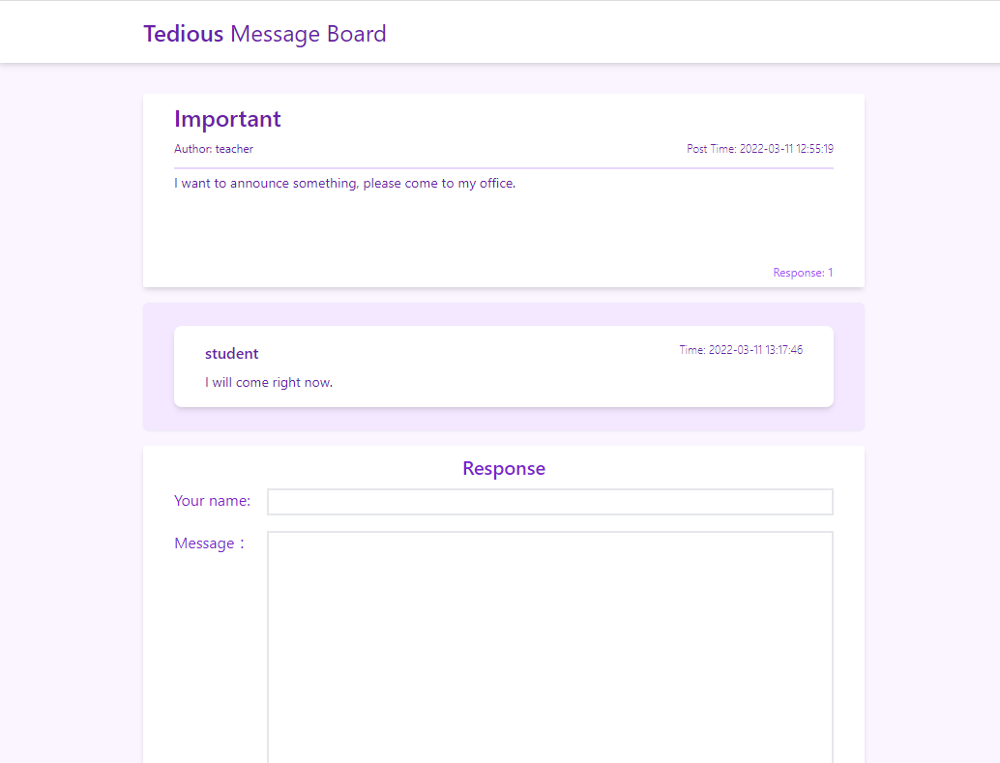

# SIMPLE MESSAGE BOARD

## Overview
This application is simple message board, which everyone can post something and response to any post. However, there is no access authentication and recaptcha scheme, do not use to release.

## Technology Stack
### Infrastructure
* PostgreSQL
* Nginx
* ASGI
* Docker

### Backend RESTful API
* FastAPI
* SQLAlchemy Asynchronous I/O

### Frontend Webpage
* Creat React App
* Redux-Saga
* Tailwind CSS

## Getting started
```sh
docker-compose up
```

## Demo


